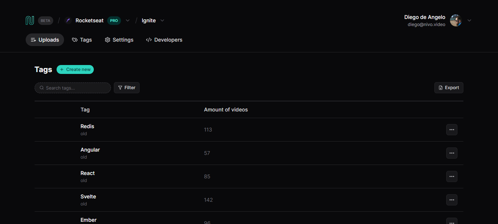
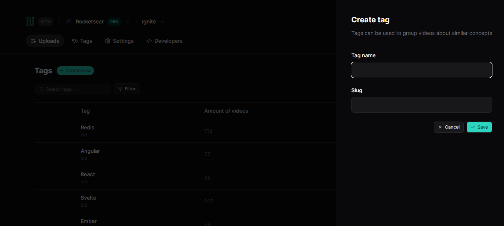

<p align="left">

  
  

  

</p>

### Tópicos

:small_blue_diamond: [Sobre o Projeto](#star-sobre-o-projeto)

:small_blue_diamond: [Objetivo](#dart-objetivo)

:small_blue_diamond: [Imagens](#sunrise_over_mountains-imagens)

:small_blue_diamond: [Funcionalidades](#bookmark_tabs-funcionalidades)

:small_blue_diamond: [Como rodar a aplicação](#arrow_forward-como-rodar-a-aplicação)

## :star: Sobre o Projeto

Aplicação desenvolvida durante o evento React na Prática, evento gratuito organizado pela Rocketseat (https://www.rocketseat.com.br/).

Este projeto foi desenvolvido utilizando:

:heavy_check_mark: Vite + React

:heavy_check_mark: TanStack Query

:heavy_check_mark: Radix UI

:heavy_check_mark: Tailwind

:heavy_check_mark: json-server como back-end

## :dart: Objetivo

Desenvolvimento de uma aplicação para categorização de videos com tags similares

## :bookmark_tabs: Funcionalidades

:white_check_mark: Listagem com Filtro
:white_check_mark: Criação

## :sunrise_over_mountains: Imagens

<details>
<summary> Imagens da Aplicação </summary>




</details>

## :arrow_forward: Como rodar a aplicação

#### :heavy_check_mark: Clonando o Projeto

- No terminal, clone o projeto:

  ```
  https://github.com/dgo-angelo/react-na-patica.git
  ```

### :arrow_forward: Executando a aplicação

- Acessar a pasta raiz do projeto e instalar as dependencias através do comando:

```
npm install
```

- Após instalar as dependencias, será necessário executar o server:

```
npm run server
```

- Após executar o server, é só iniciar a aplicação

```
npm run dev
```
